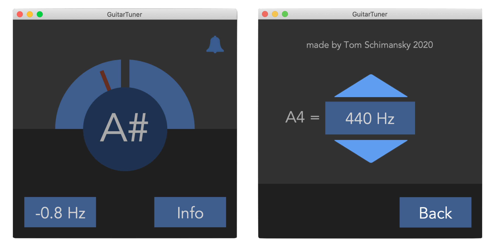

# GuitarTuner-App

This is a simple guitar tuner program written in python with Tkinter and PyAudio.
The played note is automatically recognized and an acoustic signal is heard when the tuning is correct. If you want you can also change the reference tone to another frequency.

### Run GuitarTuner
Firsta you need to install all necessary libraies:
```
pip install -r requirements.txt
```
Then you can do:
```
python main.py


### Create standalone application
To create a standalone application use py2app or py2exe, and make sure you got the exact same library versions as in my requirements.txt.

For macOS you need py2app:
```
python3.8 setup.py py2app
```
For windows you need to use py2exe instead.

To keep application size as small as possible, make sure you create a virtual environment where you install only the necessary libraries.
